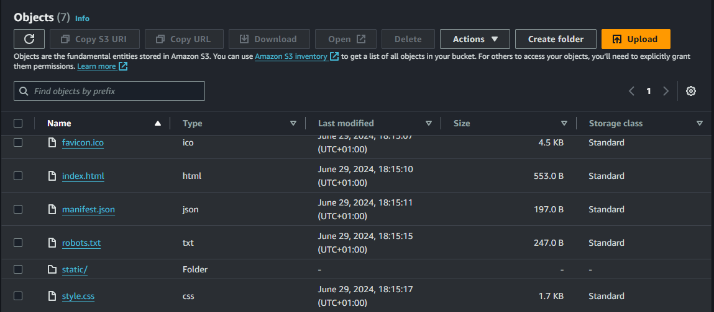

# Deploying The Cross Region Failover Demo Application

To set up the infra, initialize terraform in the directory and apply the terraform configuration.

```
terraform init
terraform apply --auto-approve
```

## Setting Up the Frontend

### cognito values

The frontend requires some cognito values to enable authentication. Once terraform completes, it outputs some values an example of how it looks:

```
{
    cognito_user_pool_id = "us-east-1_KNXECmyfq"
    cognito_identity_pool_id = "us-east-1:1c4a9aaf-6d4f-4a7a-ab35-c666bb6b15e0"
    cognito_web_client_id = "1iihtdvo37cpjjq3e6dgq8p1u8"
    cognito_domain_place_holder = "crf-remittance-terraform.auth.us-east-1.amazoncognito.com"
    cloudfront_domain = "d2ve44te6khtee.cloudfront.net"
    domain_name = "demo.devopslord.com"
}

```

These values returned from terraform output should be replaced into the frontend in cognito.tsx found in `/src/ui/src/components/home/cognito.tsx`

an example of how it looks:

```
  const amplifyConfig = {
    Auth: {
      mandatorySignIn: true,
      region: 'us-east-1',
      userPoolId: 'us-east-1_KNXECmyfq', // USER_POOL_ID_PLACEHOLDER
      identityPoolId: 'us-east-1:1c4a9aaf-6d4f-4a7a-ab35-c666bb6b15e0', // IDENTITY_POOL_ID_PLACEHOLDER
      userPoolWebClientId: '1iihtdvo37cpjjq3e6dgq8p1u8', // WEB_CLIENT_ID_PLACEHOLDER
      oauth: {
        domain: 'crf-remittance-terraform.auth.us-east-1.amazoncognito.com',
        redirectSignIn: 'http://d2ve44te6khtee.cloudfront.net',
        redirectSignOut: 'http://d2ve44te6khtee.cloudfront.net',
        responseType: 'code' // or 'token', note that REFRESH token will only be generated when the responseType is code
      }
    }
  };
```

### Apiagetway Domain Endpoint

Navigate to `src/ui/src/config/index.ts`

Replace the endpoint key with your apigateway domain name example below:

```

export const REMITTANCE_ENDPOINTS = {
    ApiKey: '',         // NOTE: Replace with your API Gateway key value
    Endpoint: 'https://demo.devopslord.com',     // NOTE: Replace with the URL of your API service endpoint
    Resources : ['get-remittances', 'create-remittance', 'update-remittance', 'delete-remittance', 'execute-runbook']
};


```

### Production build

Run a production build for the frontend. Ensure that you have node js installed on your machine.

```
npm install

npm run build
```

## Upload To s3

Once the frontend build is completed, it should create a folder named build in `src/ui/build` all the content of the folder is what should be uploaded to s3 bucket created by terraform both secondary and primary bucket.

Upload the file content to both s3 buckets in region1 (`frontend-bucket-primary`) and region2 (`frontend-bucket-secondary`)

